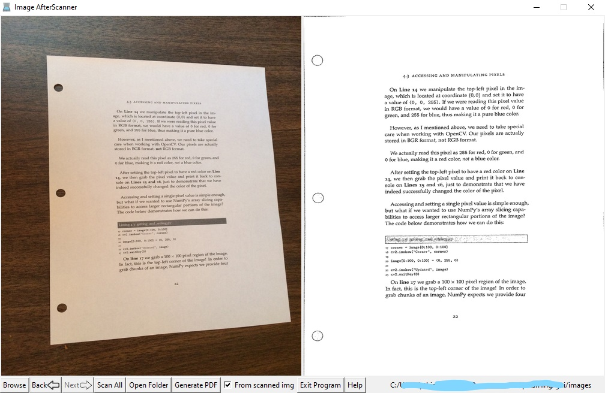

# Image-AfterScanner
Convert photo images to scanned images, and create a pdf document from those images

This app is written in Python, so I welcome all beginners to make positive pull requests!

# For those who want a handy tool for generating pdf submission of tests, exams, etc. 

## Functionalities:
1. Browse directory 
2. Convert each image to the scanned version
3. Scan all images in the folder
4. Generate a nice pdf documentation from scanned images or original images
5. No more hassle handling written exam and test submissions at home during quarantine!

# Download

## Click the release tag in this page in order to download this application

## Usage

1. Put all images (*.jp[e]g, *.png) into a folder, name each page in order. For example, page1.jpg, page2.jpg, etc
2. Open the app, press `Browse` to nagvigate to the folder from the step 1
3. Click the `Scan All` and `Generate PDF` buttons in order to generate a complete PDF ready for submission.
4. Tips: the photo must capture the whole single page with 4 corners on a darker background. Out of focus photos will result in low quality scanned images, so you should pay more attention on taking good input photos. 

# Development Environment Setup

1. Install python3 in Windows 10 via Visual Studio 2019 or standalone python distribution
2. Install third-party libs: numpy, opencv, scikit-image, win10toast

   `pip install numpy`

   `pip install opencv-python`

   `pip install opencv-python`
   
   `pip install scikit-image`

   `pip install win10toast`

    Note: if pip is not found, please add use `python -m pip`, or `py -m pip`

3. From the project folder, run `py app.py` or `python app.py`

# Create the standalone .exe application
1. Install pyinstaller: `pip install pyinstaller`, or: `python -m pip install pyinstaller`
2. From the project folder, run: `pyinstaller.exe --onefile --windowed --add-data "resources/*.ico;resources/" --icon=resources/icon.ico  .\app.py`

3. Check the `dist` folder to see the `app.exe` application. In the first time launching the app, it will take longer time than usual to unpack the data to the temporary folder.

